# Visualize Mechanics

A desktop application that transforms physics problem photos into interactive 3D animations with worked solutions. Built for high school mechanics (kinematics, forces, energy).

**Key Features:**
- **Desktop-first design** with Electron wrapping for cross-platform support
- **Flexible AI backend**: Use cloud APIs (NVIDIA NIM) or local models (BYOK)
- **Privacy-focused**: Run entirely locally with your own models
- **Interactive 3D visualizations** powered by Three.js and React Three Fiber

## Tech Stack

### Frontend (Web + Desktop)
| Layer | Technology | Purpose |
|-------|------------|---------|
| Framework | **React** + **Vite** | Modern web framework with fast dev server |
| Desktop Wrapper | **Electron** | Cross-platform desktop app (Windows/Mac/Linux) |
| Language | TypeScript | Type safety |
| 3D Rendering | **react-three-fiber** (r3f) + **@react-three/drei** | Declarative Three.js in React |
| Camera/Photo | HTML5 File API | Photo capture & upload |
| State | Zustand | Global state (animation time, problem data) |
| Animations | React hooks + requestAnimationFrame | Smooth timeline scrubber |
| Build Tool | Vite + Electron Builder | Optimized builds and desktop packaging |

### Backend (API Proxy + AI Orchestration) — Lightweight / Stateless
| Layer | Technology | Purpose |
|-------|------------|---------|
| Runtime | **Python** (FastAPI) | Minimal API server |
| Language | Python 3.11+ | FastAPI, Pydantic, httpx |
| AI Proxy | NVIDIA NIM APIs OR Local Models (BYOK) | Vision + reasoning |
| Image Processing | Pillow / OpenCV (optional) | Resize/compress before model call |
| Queue | **None** (sync request/response) | Keep it simple — no Redis/Celery |
| Auth | **None** | No accounts, no auth |
| Database | **None** | Stateless — no persistence |
| File Storage | **None** | Images sent directly to model, not stored |

### AI Pipeline (Flexible)
```
Photo → Vision Model (extract problem text/diagram)
      → Reasoning Model (classify scenario, derive equations, compute values)
      → Structured Output (animation spec + worked solution + time-series data)
```

**Model Options:**
- **Cloud**: NVIDIA NIM APIs (Llama 3.2 Vision, Nemotron, etc.)
- **Local**: Bring Your Own Key (BYOK) - Ollama, LocalAI, or custom model endpoints

---

## Architecture Overview

```mermaid
flowchart LR
    A[React + Electron (Vite)] --> B[Backend API (FastAPI)]
    B --> C[AI Model APIs (Vision + Reasoning)]
    
    B -.-> D[Stateless, no DB, no queue. Proxy only: forwards photo → Model → returns JSON]
```

### Data Flow
1. **User** snaps photo of physics problem
2. **Frontend** uploads to backend `/api/problems`
3. **Backend** processes image → calls AI Vision → extracts problem text & diagram
4. **Backend** calls AI Reasoning → classifies scenario, computes solution
5. **Backend** returns structured JSON:
   ```json
   {
     "scenario": "projectile_motion",
     "parameters": { "v0": 20, "angle": 45, "g": 9.8 },
     "animationSpec": { "duration": 4.0, "keyframes": [...] },
     "workedSolution": { "steps": [...], "finalAnswer": "..." },
     "timeSeries": { "t": [0, 0.1, ...], "x": [...], "y": [...], "vx": [...], "vy": [...] }
   }
   ```
6. **Frontend** renders 3D scene via r3f, drives animation with timeline scrubber
7. **Scrubber** reads `timeSeries` to show live variable values at each `t`

---

## Project Structure

```mermaid
flowchart TB
    subgraph Root["visualize-mechanics/"]
        direction TB
        Backend["backend/"]
        Frontend["frontend/"]
        Electron["electron/"]
        Docs["docs/"]
        RootPkg["package.json"]
        RootReadme["README.md"]
    end
    
    subgraph Backend["backend/"]
        direction TB
        App["app/"]
        PyProject["pyproject.toml"]
        Env["`.env`"]
    end
    
    subgraph App["app/"]
        direction TB
        Main["main.py"]
        Routes["routes/"]
        Services["services/"]
        Schemas["schemas/"]
    end
    
    subgraph Frontend["frontend/"]
        direction TB
        Src["src/"]
        Pkg["package.json"]
        Env2["`.env`"]
    end
    
    subgraph Src["src/"]
        direction TB
        Components["components/"]
        Scenes["scenes/"]
        Store["store/"]
        AppJX["App.jsx"]
    end
    
    subgraph Electron["electron/"]
        direction TB
        MainJS["main.js"]
        Preload["preload.js"]
    end
    
    subgraph Docs["docs/"]
        direction TB
        PHASE1["PHASE1.md"]
        PHASE2["PHASE2.md"]
    end
```



---

## Non-Coding Requirements

### 1. AI Model Access (Choose One)
- [ ] **Cloud Option**: Create NVIDIA account & get NGC API key for NIM endpoints
- [ ] **Local Option**: Set up local model server (Ollama, LocalAI, or custom)

### 2. Infrastructure (Minimal - Desktop Only)
- [ ] **Desktop**: Electron builds for Windows/Mac/Linux
- [ ] **Backend**: Runs locally via Electron subprocess (no separate hosting needed)

### 3. AI Prompt Engineering
- [ ] Design **Vision prompt**: Extract structured problem from photo (text + diagram → JSON)
- [ ] Design **Reasoning prompt**: Classify scenario, derive equations, compute time-series
- [ ] Create **few-shot examples** for each mechanics scenario
- [ ] Build **eval set** (20-50 problems) to test accuracy

### 4. Animation Library (Pre-built Scenes)
Define reusable r3f scenes for each scenario:

| Scenario | Key Variables | Animation Spec |
|----------|---------------|----------------|
| Projectile motion | `x, y, vx, vy, t` | Parabolic trajectory |
| 1D kinematics | `x, v, a, t` | Position/velocity graphs |
| Inclined plane | `x, v, a, F_normal, F_friction, t` | Block sliding |
| Atwood machine | `y1, y2, v, a, T, t` | Two masses + pulley |
| Energy conservation | `h, v, KE, PE, E_total, t` | Roller coaster / pendulum |

---

## Development Setup

```bash
# 1. Clone & install
git clone <repo>
cd visualize-mechanics

# 2. Install root dependencies (Electron)
npm install

# 3. Backend
cd backend
cp .env.example .env  # Add AI_API_KEY or configure local models
python -m venv venv
source venv/bin/activate  # Windows: venv\Scripts\activate
pip install -e .
uvicorn app.main:app --reload

# 4. Frontend
cd ../frontend
npm install
npm run dev           # Web dev server (optional, for web preview)

# 5. Electron (for full desktop app)
cd ..
npm run electron:dev  # Desktop app with backend integration
```

---

## Environment Variables

### Backend (`backend/.env`)
```env
# Cloud option (NVIDIA NIM)
NIM_API_KEY=nvapi-xxxxx
NIM_VISION_MODEL=nvidia/llama-3.2-90b-vision-instruct
NIM_REASONING_MODEL=nvidia/nemotron-3-ultra

# OR Local option (BYOK) - e.g., Ollama
LOCAL_MODEL_URL=http://localhost:11434
LOCAL_VISION_MODEL=llava
LOCAL_REASONING_MODEL=llama3.1

# Common
PORT=3000
HOST=0.0.0.0
CORS_ORIGINS=*
```

### Frontend (`frontend/.env`)
```env
VITE_API_URL=http://localhost:3000
VITE_ENABLE_LOCAL_MODELS=false  # Set to true for local model support
```

---

## MVP Checklist

- [ ] Photo upload → backend → AI Vision → extract problem
- [ ] AI Reasoning → classify scenario + compute solution + time-series
- [ ] Backend returns structured JSON to frontend
- [ ] Frontend renders correct r3f scene for scenario
- [ ] Timeline scrubber drives animation + shows live variables
- [ ] Worked solution displayed step-by-step
- [ ] Electron build produces desktop app

---

## Implementation Phases

### Phase 0: Foundation & Prompt Engineering
- [ ] Set up monorepo structure (backend + frontend)
- [ ] Scaffold backend (FastAPI + Python) with `POST /api/solve` endpoint
- [ ] Scaffold React + Electron app with file upload
- [ ] Get AI API key or set up local model server
- [ ] **Design & iterate prompts**:
  - Vision prompt: photo → structured problem JSON (knowns, unknowns, diagram description)
  - Reasoning prompt: problem JSON → scenario classification + equations + time-series + worked solution
- [ ] Build eval set (20-30 diverse mechanics problems) + test harness

### Phase 1: Backend AI Pipeline (COMPLETE)
- [x] Implement AI client with retry/timeout/error handling (httpx + tenacity)
- [x] Wire Vision → Reasoning pipeline in `/api/solve`
- [x] Define strict Pydantic response schema (validation + serialization)
- [x] Add image preprocessing (Pillow: resize, compress, base64)
- [x] **Add calculation validation + retry loop** (prevents formula hallucinations)
- [x] Test end-to-end with eval set, measure accuracy/latency
- [ ] **Deploy backend**: N/A — runs locally via Electron

### Phase 2: Core Web App + 3D Scenes
- [ ] Build React app screens: Upload → Loading → Result
- [ ] Implement shared types between backend and frontend
- [ ] Create r3f scene components for **2-3 core scenarios** (projectile, 1D motion, inclined plane)
- [ ] Build animation player: timeline scrubber → reads `timeSeries` → updates r3f uniforms
- [ ] Display worked solution steps below animation
- [ ] Polish UI: loading states, error handling, variable value overlay
- [ ] Integrate Electron wrapper for desktop app

### Phase 3: Polish & Ship
- [ ] Add remaining scenarios (Atwood, energy conservation)
- [ ] Expand eval set, improve prompt accuracy
- [ ] Performance: optimize r3f render loop, memoize timeSeries lookups
- [ ] Desktop packaging: Electron Builder for Windows/Mac/Linux
- [ ] Local model integration: UI for configuring local model endpoints
- [ ] Documentation: User guide for local model setup
- [ ] Launch 🚀

### Phase 4: Post-Launch (Ongoing)
- [ ] User feedback → prompt improvements
- [ ] More scenarios (collisions, circular motion, springs)
- [ ] Offline caching of recent animations
- [ ] Enhanced local model support (GPU acceleration, quantization)
- [ ] Teacher features (problem sets, classroom codes)

---

## Future Enhancements

- Multi-step problems (collisions, multi-body)
- User-drawn free-body diagrams
- Voice input for problem descriptions
- Teacher dashboard (assign problems, view student work)
- Offline mode (cached animations + local models)
- Community problem sharing
- AR mode (project animation onto desk)

---

## Local Model Support

This application supports Bring Your Own Key (BYOK) for local AI models:

### Supported Local Model Servers:
- **Ollama**: `ollama run llava` for vision, `ollama run llama3.1` for reasoning
- **LocalAI**: Drop-in OpenAI-compatible API replacement
- **Custom**: Any HTTP endpoint that provides vision and reasoning capabilities

### Configuration:
1. Set `VITE_ENABLE_LOCAL_MODELS=true` in frontend `.env`
2. Configure local model URL in backend `.env`
3. Restart backend and frontend
4. The app will use local models instead of cloud APIs

This gives you:
- **Privacy**: All processing happens on your machine
- **No Cost**: No API fees
- **Control**: Use any model you want
- **Offline**: Works without internet connection