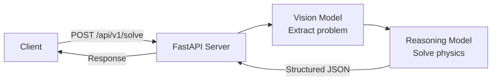

# Visualize Mechanics Backend

(Work in progress) desktop ap that accepts physics problem photos, calls NVIDIA NIM (Vision → Reasoning), and returns structured JSON for 3D animation + worked solution.



## Quick Start

```bash
cd backend
cp .env.example .env  # Add your NIM_API_KEY
python -m venv venv
source venv/bin/activate  # Windows: venv\Scripts\activate
pip install -e .[dev]
uvicorn app.main:app --reload
```

Server runs at `http://localhost:3000`

## API

### `POST /api/v1/solve`

Solve a physics problem from an image.

**Multipart (recommended):**
```bash
curl -X POST http://localhost:3000/api/v1/solve \
  -F "file=@problem.jpg"
```

**JSON (base64):**
```bash
curl -X POST http://localhost:3000/api/v1/solve \
  -H "Content-Type: application/json" \
  -d '{"image_b64": "...", "content_type": "image/jpeg"}'
```

**Response:**
```json
{
  "scenario": "projectile_motion",
  "parameters": {"v0": 20.0, "angle_deg": 45.0, "g": 9.8},
  "animation_spec": {"duration_s": 2.89, "fps": 30, "camera": {"position": [0,5,15], "target": [0,2,0]}},
  "worked_solution": {
    "steps": [{"step": 1, "description": "Identify knowns", "equation": null}],
    "final_answer": {"range": "40.8 m", "max_height": "10.2 m"}
  },
  "time_series": {"t": [0.0, 0.1, ...], "x": [...], "y": [...], "vx": [...], "vy": [...]}
}
```

### `GET /api/v1/health`

Health check endpoint.

## Testing

```bash
pytest -v
```

## Environment Variables

| Variable | Description | Default |
|----------|-------------|---------|
| `NIM_API_KEY` | NVIDIA NGC API key | Required |
| `NIM_BASE_URL` | NIM API base URL | `https://integrate.api.nvidia.com/v1` |
| `NIM_VISION_MODEL` | Vision model name | `nvidia/llama-3.2-90b-vision-instruct` |
| `NIM_REASONING_MODEL` | Reasoning model name | `nvidia/nemotron-3-ultra` |
| `PORT` | Server port | `3000` |
| `HOST` | Server host | `0.0.0.0` |
| `CORS_ORIGINS` | Comma-separated CORS origins | `*` |

## Deployment

### Docker
```bash
docker build -t visualize-backend .
docker run -p 3000:3000 --env-file .env visualize-backend
```

### Render/Fly.io
1. Connect GitHub repo
2. Set environment variables
3. Deploy (uses `Dockerfile`)