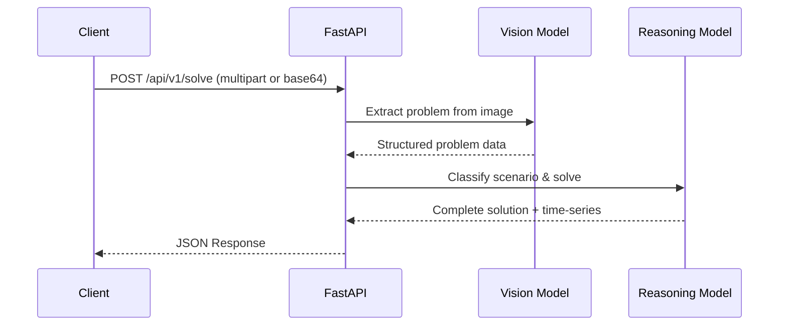

# Phase 1: Backend NIM Pipeline — Detailed Implementation Plan

**Goal**: Build a stateless FastAPI service that accepts a physics problem photo, calls NIM models (NVIDIA NIM or local models via BYOK) (Vision → Reasoning), and returns structured JSON for the web/desktop app to render.

**Duration**: 1 week (5 working days)

**Prerequisites**: Phase 0 complete (backend/frontend structure scaffolded, NIM API key or local model server working, eval set of 20-30 problems)

**Note**: This backend supports both cloud (NVIDIA NIM) and local models (BYOK - Bring Your Own Key). Configuration via environment variables determines which mode is used.

---

## 1. Technical Design

### 1.1 API Contract



**Endpoint**: `POST /api/v1/solve`

**Request** (multipart/form-data):
- `file`: UploadFile (JPEG or PNG, max 10MB)
- `content_type`: Optional[str] = "image/jpeg" (inferred from file)

**Request** (application/x-www-form-urlencoded):
- `image_b64`: Base64-encoded JPEG/PNG
- `content_type`: Optional[str] = "image/jpeg"

**Response** (200 OK):
```json
{
  "scenario": "projectile_motion",
  "parameters": {
    "v0": 20.0,
    "angle_deg": 45.0,
    "g": 9.8,
    "initial_height": 0.0
  },
  "animation_spec": {
    "duration_s": 4.08,
    "fps": 30,
    "camera": { "position": [0, 5, 15], "target": [0, 2, 0] }
  },
  "worked_solution": {
    "steps": [
      { "step": 1, "description": "Identify knowns: v₀=20 m/s, θ=45°, g=9.8 m/s²", "equation": null },
      { "step": 2, "description": "Resolve initial velocity into components", "equation": "v₀ₓ = v₀cosθ, v₀ᵧ = v₀sinθ" },
      { "step": 3, "description": "Time of flight: t = 2v₀ᵧ/g", "equation": "t = 2(20sin45°)/9.8 ≈ 2.89 s" }
    ],
    "final_answer": { "range": "40.8 m", "max_height": "10.2 m", "time_of_flight": "2.89 s" }
  },
  "time_series": {
    "t": [0.0, 0.1, 0.2, ..., 2.89],
    "x": [0.0, 1.41, 2.83, ..., 40.8],
    "y": [0.0, 1.32, 2.45, ..., 0.0],
    "vx": [14.14, 14.14, 14.14, ..., 14.14],
    "vy": [14.14, 13.16, 12.18, ..., -14.14],
    "ax": [0.0, 0.0, ..., 0.0],
    "ay": [-9.8, -9.8, ..., -9.8],
    // Additional fields per scenario (all optional):
    "z": [...], "vz": [...], "az": [...],
    "v": [...], "a": [...],
    "theta": [...], "omega": [...], "alpha": [...],
    "ke": [...], "pe": [...], "e_total": [...],
    "x_eq": [...], "force": [...],
    "f_normal": [...], "f_friction": [...], "tension": [...]
  }
}
```

**Error Responses**:
- 400: Invalid image / missing fields / file too large (>10MB) / invalid base64 / unsupported content type
- 422: Vision/Reasoning failed to parse problem (validation error)
- 500: NIM API error / internal error
- 504: NIM timeout (via retry exhaustion)

**Health Check**: `GET /api/v1/health` → `{"status": "ok"}`

---

### 1.2 Data Models (Pydantic)

```python
# app/schemas/request.py
class SolveRequest(BaseModel):
    image_b64: str = Field(..., description="Base64-encoded image")
    content_type: Literal["image/jpeg", "image/png"] = "image/jpeg"

class SolveRequestMultipart(BaseModel):
    """For multipart/form-data parsing"""
    file: bytes
    content_type: Literal["image/jpeg", "image/png"] = "image/jpeg"


# app/schemas/vision.py
class VisionOutput(BaseModel):
    problem_text: str = Field(..., description="Full problem text extracted via OCR")
    knowns: dict[str, float | str] = Field(..., description="Known variables with values and units")
    unknowns: list[str] = Field(..., description="Unknown variables asked for")
    diagram_description: str = Field(..., description="Description of diagram (objects, forces, coordinates, angles)")
    suggested_scenario: Literal[
        "projectile_motion",
        "kinematics_1d",
        "inclined_plane",
        "atwood_machine",
        "collision_1d",
        "rotational_kinematics",
        "mass_spring",
        "unknown"
    ] = Field(..., description="Suggested scenario classification")


# app/schemas/reasoning.py
class ReasoningOutput(BaseModel):
    scenario: Literal[
        "projectile_motion",
        "kinematics_1d",
        "inclined_plane",
        "atwood_machine",
        "collision_1d",
        "rotational_kinematics",
        "mass_spring"
    ] = Field(..., description="Classified scenario")
    parameters: dict[str, float] = Field(..., description="All parameters in SI units")
    animation_spec: AnimationSpec = Field(..., description="Animation configuration")
    worked_solution: WorkedSolution = Field(..., description="Step-by-step worked solution")
    time_series: TimeSeries = Field(..., description="Time-series data at 30 FPS")


class AnimationSpec(BaseModel):
    duration_s: float = Field(..., description="Total animation duration in seconds")
    fps: int = Field(30, description="Frames per second for time series")
    camera: "CameraSpec" = Field(..., description="Camera position and target")


class CameraSpec(BaseModel):
    position: list[float] = Field(..., min_length=3, max_length=3, description="[x, y, z] camera position")
    target: list[float] = Field(..., min_length=3, max_length=3, description="[x, y, z] camera target")


class SolutionStep(BaseModel):
    step: int = Field(..., ge=1, description="Step number")
    description: str = Field(..., description="Human-readable explanation")
    equation: Optional[str] = Field(None, description="Equation used in this step")


class WorkedSolution(BaseModel):
    steps: list[SolutionStep] = Field(..., min_length=1, description="Step-by-step solution")
    final_answer: dict[str, str] = Field(..., description="Final answers with units (e.g., {'range': '40.8 m'})")


class TimeSeries(BaseModel):
    t: list[float] = Field(..., description="Time points (seconds)")
    # Translational
    x: Optional[list[float]] = None
    y: Optional[list[float]] = None
    z: Optional[list[float]] = None
    vx: Optional[list[float]] = None
    vy: Optional[list[float]] = None
    vz: Optional[list[float]] = None
    v: Optional[list[float]] = None
    ax: Optional[list[float]] = None
    ay: Optional[list[float]] = None
    az: Optional[list[float]] = None
    a: Optional[list[float]] = None
    # Rotational
    theta: Optional[list[float]] = None
    omega: Optional[list[float]] = None
    alpha: Optional[list[float]] = None
    # Energy
    ke: Optional[list[float]] = None
    pe: Optional[list[float]] = None
    e_total: Optional[list[float]] = None
    # Spring
    x_eq: Optional[list[float]] = None  # displacement from equilibrium
    # Forces
    f_normal: Optional[list[float]] = None
    f_friction: Optional[list[float]] = None
    tension: Optional[list[float]] = None
    force: Optional[list[float]] = None  # spring force


# app/schemas/response.py
class SolveResponse(BaseModel):
    scenario: str = Field(..., description="Classified scenario")
    parameters: dict[str, float] = Field(..., description="All parameters in SI units")
    animation_spec: AnimationSpec = Field(..., description="Animation configuration")
    worked_solution: WorkedSolution = Field(..., description="Step-by-step worked solution")
    time_series: TimeSeries = Field(..., description="Time-series data at 30 FPS")
```

---

### 1.3 JSON Extraction Utility (Critical)

LLMs often wrap JSON in markdown fences (```json ... ```) or add conversational filler ("Sure! Here's the JSON:"). We need a **defensive, idempotent** extractor that:
- Returns valid JSON unchanged
- Strips markdown fences
- Removes leading/trailing conversational text
- Finds the first valid JSON object/array in the response

```python
# app/utils/json_extract.py
import json
import re
from typing import Any


def extract_json(text: str) -> dict[str, Any] | list[Any]:
    """
    Extract JSON from LLM response. Idempotent: valid JSON passes through unchanged.
    
    Handles:
    - Raw JSON: '{"key": "value"}'
    - Markdown fenced: '```json\n{"key": "value"}\n```'
    - Conversational: 'Here is your JSON:\n{"key": "value"}'
    - Mixed: '```json\n{"key": "value"}\n``` Thanks!'
    """
    if not text or not text.strip():
        raise ValueError("Empty response")
    
    text = text.strip()
    
    # Fast path: already valid JSON
    try:
        return json.loads(text)
    except json.JSONDecodeError:
        pass
    
    # Strip markdown fences (```json ... ``` or ``` ... ```)
    fence_pattern = r'^```(?:json)?\s*\n?(.*?)\n?```$'
    match = re.search(fence_pattern, text, re.DOTALL | re.IGNORECASE)
    if match:
        candidate = match.group(1).strip()
        try:
            return json.loads(candidate)
        except json.JSONDecodeError:
            pass
    
    # Find first JSON-like object/array in text
    # Look for { ... } or [ ... ] with balanced braces
    for start_char, end_char in [('{', '}'), ('[', ']')]:
        start_idx = text.find(start_char)
        if start_idx == -1:
            continue
        
        # Find matching closing brace
        depth = 0
        for i, ch in enumerate(text[start_idx:], start=start_idx):
            if ch == start_char:
                depth += 1
            elif ch == end_char:
                depth -= 1
                if depth == 0:
                    candidate = text[start_idx:i+1]
                    try:
                        return json.loads(candidate)
                    except json.JSONDecodeError:
                        break
    
    raise ValueError(f"Could not extract valid JSON from response: {text[:200]}...")
```

**Usage in NIM client**:
```python
from app.utils.json_extract import extract_json

async def vision_extract(self, image_b64: str, content_type: str) -> VisionOutput:
    response = await self.vision_client.chat.completions.create(...)
    raw = response.choices[0].message.content
    data = extract_json(raw)  # ← robust extraction
    return VisionOutput.model_validate(data)
```

---

### 1.4 NIM Client Design

Supporting both **NVIDIA NIM** (cloud) and **Local Models** (BYOK) via OpenNIM-compatible client:

```python
# app/services/ai_client.py
from openai import AsyncOpenNIM  # Both NIM and local models expose OpenNIM-compatible endpoint
from tenacity import retry, stop_after_attempt, wait_exponential, retry_if_exception_type

class NIMClient:
    def __init__(self):
        # Support both cloud (NIM) and local models
        self.use_local = settings.USE_LOCAL_MODELS
        
        if self.use_local:
            self.client = AsyncOpenNIM(
                api_key="not-needed",  # Local models often don't require API key
                base_url=settings.LOCAL_MODEL_URL,
            )
            self.vision_model = settings.LOCAL_VISION_MODEL
            self.reasoning_model = settings.LOCAL_REASONING_MODEL
        else:
            self.client = AsyncOpenNIM(
                api_key=settings.NIM_API_KEY,
                base_url=settings.NIM_BASE_URL,
            )
            self.vision_model = settings.NIM_VISION_MODEL
            self.reasoning_model = settings.NIM_REASONING_MODEL

    @retry(
        wait=wait_exponential(multiplier=1, min=2, max=10),
        stop=stop_after_attempt(3),
        retry=retry_if_exception_type((Exception,)),
        reraise=True,
    )
    async def vision_extract(self, image_b64: str, content_type: str = "image/jpeg") -> VisionOutput:
        """Call NIM vision model to extract problem from image."""
        ...

    @retry(
        wait=wait_exponential(multiplier=1, min=2, max=10),
        stop=stop_after_attempt(3),
        retry=retry_if_exception_type((Exception,)),
        reraise=True,
    )
    async def reasoning_solve(self, vision_output: VisionOutput) -> ReasoningOutput:
        """Call NIM reasoning model to solve the physics problem."""
        ...
```

**Models** (configurable via `.env`):
- **Cloud (NIM)**:
  - Vision: `nvidia/llama-3.2-90b-vision-instruct` (default)
  - Reasoning: `nvidia/nemotron-3-ultra` (default)
- **Local (BYOK)**:
  - Vision: `llava` (Ollama) or custom model
  - Reasoning: `llama3.1` (Ollama) or custom model

**Retry/Timeout**: `tenacity` with exponential backoff (3 attempts, min 2s, max 10s wait, retries on any Exception)

**Key Implementation Notes**:
- Single `AsyncOpenNIM` client shared for both vision and reasoning calls
- Supports both cloud (NIM) and local model endpoints via configuration
- Uses `app.utils.json_extract.extract_json` for robust JSON parsing from LLM responses
- Models and API config loaded from `app.core.config.settings`
- Temperature set to 0.1 for deterministic outputs
- Vision: `max_tokens=2048`, `detail="high"` for image analysis
- Reasoning: `max_tokens=4096` for detailed solutions
- Local models may have different token limits and capabilities

---

### 1.4 Prompt Templates

**Vision Prompt** (`app/prompts/vision.txt`):
```
You are a physics problem extractor. Given a photo of a high school mechanics problem, extract:

1. Full problem text (OCR)
2. Known variables with values and units
3. Unknown variables asked for
4. Diagram description (objects, forces, coordinates, angles, inclines, pulleys, etc.)
5. Suggested scenario classification

Scenario types:
- projectile_motion: Object launched at angle, parabolic trajectory under gravity
- kinematics_1d: Straight-line motion with constant acceleration
- inclined_plane: Block on ramp with friction, forces decomposition
- atwood_machine: Two masses connected by string over pulley
- energy_conservation: Roller coaster, pendulum, spring - energy transforms

Output STRICT JSON only. No markdown, no explanations, no conversational text.

JSON schema:
{
  "problem_text": "string",
  "knowns": {"variable_name": "value with units"},
  "unknowns": ["variable_name"],
  "diagram_description": "string",
  "suggested_scenario": "projectile_motion|kinematics_1d|inclined_plane|atwood_machine|energy_conservation|unknown"
}
```

**Reasoning Prompt** (`app/prompts/reasoning.txt`):
```
You are a physics tutor. Given a structured problem (text, knowns, unknowns, diagram), produce a complete worked solution for a HIGH SCHOOL MECHANICS problem.

Scenario types: projectile_motion, kinematics_1d, inclined_plane, atwood_machine, collision_1d, rotational_kinematics, mass_spring

RULES:
- USE SI UNITS ONLY (meters, seconds, kg, N, J, rad, rad/s, rad/s²)
- Time series at 30 FPS (t = 0, 0.033, 0.067, ..., duration)
- Include t=0 through end of motion
- All numerical values as floats
- Equations in plain text (e.g., "v = v0 + a*t")
- Camera position/target appropriate for scenario

Output STRICT JSON only. No markdown, no explanations, no conversational text.

JSON schema:
{
  "scenario": "projectile_motion|kinematics_1d|inclined_plane|atwood_machine|collision_1d|rotational_kinematics|mass_spring",
  "parameters": {"param_name": float_value_in_SI},
  "animation_spec": {
    "duration_s": float,
    "fps": 30,
    "camera": {"position": [x,y,z], "target": [x,y,z]}
  },
  "worked_solution": {
    "steps": [
      {"step": 1, "description": "string", "equation": "string or null"}
    ],
    "final_answer": {"answer_name": "value with units"}
  },
  "time_series": {
    "t": [float],
    "x": [float]|null, "y": [float]|null, "z": [float]|null,
    "vx": [float]|null, "vy": [float]|null, "vz": [float]|null,
    "v": [float]|null, "ax": [float]|null, "ay": [float]|null, "az": [float]|null,
    "theta": [float]|null, "omega": [float]|null, "alpha": [float]|null,
    "ke": [float]|null, "pe": [float]|null, "e_total": [float]|null,
    "x_eq": [float]|null, "force": [float]|null,
    "f_normal": [float]|null, "f_friction": [float]|null, "tension": [float]|null
  }
}

SCENARIO-SPECIFIC GUIDANCE:

projectile_motion:
- Parameters: v0, angle_deg, g (9.8), initial_height
- Time series: t, x, y, vx, vy, ax=0, ay=-g
- Duration: time of flight = 2*v0*sin(angle)/g (+ height correction)
- Camera: position [0, 5, 15], target [0, 2, 0]

kinematics_1d:
- Parameters: x0, v0, a, t_end (or compute from v_final=0)
- Time series: t, x, v, a
- Duration: until v=0 or given t_end
- Camera: position [0, 10, 0], target [0, 0, 0] (side view)

inclined_plane:
- Parameters: mass, angle_deg, mu_s, mu_k, g (9.8), initial_x, initial_v
- Time series: t, x, v, a, f_normal, f_friction
- Determine if static friction holds or kinetic applies
- Camera: position [0, 5, 10], target [0, 0, 0]

atwood_machine:
- Parameters: m1, m2, g (9.8), pulley_mass (0 if massless), pulley_radius
- Time series: t, y1, y2, v, a, tension
- a = (m1-m2)*g / (m1+m2) (massless pulley)
- Camera: position [0, 5, 5], target [0, 0, 0]

collision_1d:
- Parameters: m1, m2, v1_initial, v2_initial, restitution (0=perfectly inelastic, 1=elastic)
- Time series: t, x1, x2, v1, v2, a1, a2, force (contact force during collision)
- Two phases: before collision (constant velocity), collision (brief, high acceleration), after collision (constant velocity)
- Duration: show ~1s before, collision, ~2s after
- Camera: position [0, 5, 10], target [0, 0, 0] (side view along collision axis)

rotational_kinematics:
- Parameters: theta0 (initial angle), omega0 (initial angular velocity), alpha (angular acceleration), t_end (or compute from omega_final=0)
- Time series: t, theta, omega, alpha
- Duration: until omega=0 or given t_end
- Camera: position [0, 5, 10], target [0, 0, 0] (side view of rotating object)

mass_spring:
- Parameters: mass, k (spring constant), x0 (initial displacement from equilibrium), v0 (initial velocity), g (9.8 if vertical), damping (0 if undamped)
- Time series: t, x_eq (displacement from equilibrium), v, a, force (=-k*x_eq - damping*v), ke, pe, e_total
- Period: T = 2*pi*sqrt(m/k) (undamped)
- Duration: 2-3 periods
- Camera: position [0, 5, 10], target [0, 0, 0] (side view of oscillating mass)
```

---

## 2. Task Breakdown

| ID | Task | Acceptance Criteria | Status |
|----|------|---------------------|--------|
| **1.1** | **Create `pyproject.toml` with deps** | `pip install -e .` works; imports resolve. Deps: `fastapi`, `uvicorn`, `pydantic`, `pydantic-settings`, `openai`, `tenacity`, `pillow`, `python-multipart`, `python-dotenv`, `pytest`, `pytest-asyncio`, `pytest-cov`, `httpx`, `ruff`, `mypy` | ✅ Done |
| **1.2** | **Config & settings (`app/core/config.py`)** | `Settings` class loads `NIM_API_KEY`, `NIM_VISION_MODEL`, `NIM_REASONING_MODEL`, `NIM_BASE_URL`, `PORT`, `HOST`, `CORS_ORIGINS` from `.env`; supports `VISUALIZE_ROOT` for monorepo; test mode uses defaults; validated at startup | ✅ Done |
| **1.3** | **Pydantic schemas (`app/schemas/`)** | All request/response models defined with 7 scenarios + unknown (vision), 7 scenarios (reasoning), extended TimeSeries with translational, rotational, energy, spring, force fields; `SolveRequestMultipart` for form parsing; `SolveResponse` serializes to exact JSON contract; unit tests for validation | ✅ Done |
| **1.4** | **JSON extraction util (`app/utils/json_extract.py`)** | `extract_json(text)` handles raw JSON, markdown fences (```json and ```), conversational filler; idempotent; finds first valid JSON object/array; unit tests for all cases including edge cases | ✅ Done |
| **1.5** | **NIM client (`app/services/nim_client.py`)** | `NIMClient` class with `vision_extract()` and `reasoning_solve()`; single shared `AsyncOpenNIM` client; retry logic via `tenacity` (3 attempts, exponential backoff 2-10s); uses `extract_json` internally; returns typed Pydantic models; temperature=0.1 | ✅ Done |
| **1.6** | **Prompt templates (`app/prompts/`)** | `vision.txt` and `reasoning.txt` exist; `vision.txt` lists 5 scenarios + unknown; `reasoning.txt` has detailed guidance for 7 scenarios with camera positions, parameters, time-series fields, physics formulas; prompts produce valid JSON per schemas | ✅ Done |
| **1.7** | **Image preprocessing (`app/services/image.py`)** | `preprocess_image(b64)` → resizes to max 1024px, converts to RGB, compresses to JPEG quality 85, returns base64; handles PNG→JPEG, RGBA→RGB; `image_to_base64(path)` helper for eval | ✅ Done |
| **1.8** | **Pipeline service (`app/services/pipeline.py`)** | `PipelineService.solve_problem(image_b64, content_type)` orchestrates: preprocess → vision → reasoning → validate → return `SolveResponse`; structured logging with `logging` module | ✅ Done |
| **1.9** | **API route (`app/routes/solve.py`)** | `POST /api/v1/solve` accepts `multipart/form-data` (file) OR `application/x-www-form-urlencoded` (image_b64 + content_type); 10MB file limit; returns `SolveResponse`; proper error codes (400, 422, 500); `GET /api/v1/health` health check | ✅ Done |
| **1.10** | **FastAPI app (`app/main.py`)** | App created with CORS for Expo dev (configurable `CORS_ORIGINS`, defaults to `*`); route included; lifespan logging; `GET /api/v1/health`; uvicorn config in pyproject.toml | ✅ Done |
| **1.11** | **Eval harness (`scripts/eval.py`)** | `EvalCase`/`EvalResult` dataclasses; runs async pipeline on test images; checks scenario accuracy + parameter accuracy (within 5%); reports latency; saves `eval_results.json`; **no eval cases defined yet** | ⚠️ Skeleton only |
| **1.12** | **Unit tests (`tests/`)** | Tests for: schemas (all models), image preprocessing (PNG/JPEG, resize, RGBA), JSON extraction (12 cases), NIM client (mocked, success + markdown/conversational wrappers), pipeline (success, vision failure, reasoning failure); `pytest` passes; uses `pytest-asyncio` strict mode | ✅ Done |
| **1.13** | **Deploy to Render/Fly.io** | `Dockerfile` **not yet created**; service runs locally via `uvicorn app.main:app`; health check at `/api/v1/health` | ❌ Not started |

---

## 3. Prompt Engineering Sub-Tasks (Embedded in 1.6)

| Sub-Task | Details | Status |
|----------|---------|--------|
| **1.6.1** | Write base vision prompt with JSON schema instructions | ✅ Done |
| **1.6.2** | Write base reasoning prompt with physics rules (SI units, 30 FPS, scenario definitions) | ✅ Done |
| **1.6.3** | Create few-shot examples per scenario (7 scenarios: projectile, 1D, incline, Atwood, collision, rotational, mass-spring) | ⚠️ Not yet in prompts |
| **1.6.4** | Test prompts manually via NIM playground / API; iterate until valid JSON | ⚠️ Pending NIM API key |
| **1.6.5** | Run eval harness; target ≥90% scenario classification accuracy, ≥80% param accuracy | ❌ Blocked (no eval cases, no API key) |

---

## 4. Definition of Done (Phase 1 Complete When)

- [x] `POST /api/v1/solve` endpoint implemented with request/response contracts
- [x] All 7 scenario types (projectile_motion, kinematics_1d, inclined_plane, atwood_machine, collision_1d, rotational_kinematics, mass_spring) produce correct JSON structure
- [x] Vision supports 5 scenarios + "unknown" classification
- [x] TimeSeries includes translational, rotational, energy, spring, and force fields
- [x] Unit tests pass for schemas, image preprocessing, JSON extraction, NIM client (mocked), pipeline
- [ ] Eval harness runs with real test cases and reports metrics (blocked: no eval images, no NIM API key)
- [ ] Backend deployed and accessible via public HTTPS URL (Dockerfile not created)
- [ ] Mobile team can integrate against live endpoint
- [ ] Latency < 10s p95 measured (Vision + Reasoning sequential)
- [ ] Cost per request documented (NIM token usage)

---

## 5. Risks & Mitigations

| Risk | Mitigation | Status |
|------|------------|--------|
| NIM returns malformed JSON | Strict Pydantic validation; `extract_json` util handles markdown fences & conversational text; retry with "output only JSON" instruction | ✅ Implemented |
| Vision misses diagram details | Explicit "describe diagram" instruction in prompt; few-shot examples needed | ⚠️ Few-shots not yet added |
| Reasoning uses wrong units | Prompt: "USE SI UNITS ONLY"; Pydantic validation enforces float values | ✅ Implemented |
| Latency too high | Sequential vision→reasoning (not parallelizable); consider smaller vision model or caching in Phase 2 | ⚠️ Not yet measured |
| NIM rate limits | Exponential backoff (3 retries, 2-10s); queue locally if needed (Phase 2) | ✅ Implemented |
| No NIM API key configured | Default test key in settings; requires real key for evaluation | ❌ Blocked |
| No eval images / test cases | Need to collect 20-30 physics problem photos with ground truth | ❌ Not started |
| Deployment not ready | Dockerfile, .env.example, README.md not created | ❌ Not started |

---

## 6. File Structure (Phase 1 Additions)

```
apps/backend/
├── app/
│   ├── __init__.py
│   ├── main.py
│   ├── core/
│   │   ├── __init__.py
│   │   └── config.py
│   ├── routes/
│   │   ├── __init__.py
│   │   └── solve.py
│   ├── services/
│   │   ├── __init__.py
│   │   ├── nim_client.py
│   │   ├── image.py
│   │   └── pipeline.py
│   ├── schemas/
│   │   ├── __init__.py
│   │   ├── request.py       # SolveRequest, SolveRequestMultipart
│   │   ├── vision.py
│   │   ├── reasoning.py
│   │   └── response.py
│   ├── utils/
│   │   ├── __init__.py
│   │   └── json_extract.py
│   └── prompts/
│       ├── __init__.py      # Loads vision.txt, reasoning.txt as VISION_PROMPT, REASONING_PROMPT
│       ├── vision.txt
│       └── reasoning.txt
├── tests/
│   ├── __init__.py
│   ├── conftest.py          # pytest-asyncio config
│   ├── test_schemas.py
│   ├── test_image.py
│   ├── test_json_extract.py
│   ├── test_nim_client.py
│   └── test_pipeline.py
├── scripts/
│   └── eval.py
├── pyproject.toml
├── Dockerfile               # NOT YET CREATED
├── .env.example             # NOT YET CREATED
└── README.md                # NOT YET CREATED
```

---

## 7. Next Steps (Phase 2 Preview)

- Mobile: `POST /api/v1/solve` integration with Expo
- Shared types package (TypeScript ↔ Pydantic parity)
- r3f scene components for projectile + 1D motion
- Timeline scrubber with Reanimated