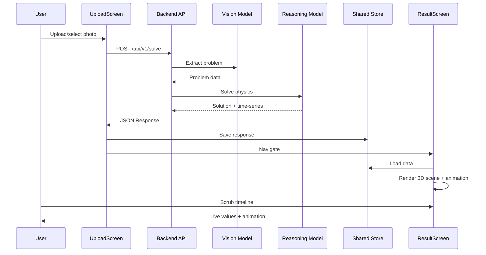

# Phase 2: Core Web/Desktop App + 3D Scenes — Detailed Implementation Plan

**Goal**: Build the React + Electron web/desktop application that accepts physics problem photos, calls the backend API, renders interactive 3D animations using react-three-fiber, displays worked solutions, and includes a timeline scrubber for educational exploration.

**Duration**: 1 week (5 working days)

**Prerequisites**: 
- Phase 1 complete (backend API deployed and accessible via public HTTPS URL)
- AI API key or local model server configured and working
- Shared understanding of API contract between backend and frontend

---

## 1. Technical Design

### 1.1 Web/Desktop App Architecture

```mermaid
flowchart LR
    Upload[UploadScreen<br/>(HTML5 File API)] --> Loading[LoadingScreen<br/>(spinner/text)]
    Loading --> Result[ResultScreen<br/>(r3f + UI + scrub)]
    
    Loading --> Store[(Shared Store<br/>Zustand)]
    Result --> Store
    Store --> API[Backend API<br/>(Deployed)]
```

### 1.2 Screen Specifications

#### UploadScreen
- Uses HTML5 File API for photo capture/upload
- Drag-and-drop support for desktop
- Preview of selected image before upload
- Upload button that calls `/api/v1/solve` endpoint
- Loading state during upload/processing

#### LoadingScreen
- Shows spinner and descriptive text ("Processing your physics problem...")
- Optional progress indicators if backend supports it
- Auto-navigates to ResultScreen on success
- Shows error state with retry option on failure

#### ResultScreen
- 3D visualization using `@react-three/fiber` and `@react-three/drei`
- Timeline scrubber at bottom using `react-native-reanimated`
- Worked solution display area (steps + final answers)
- Variable value overlays on 3D objects (live updating)
- Error state with retry option

### 1.3 Component Breakdown

#### Shared Types
- TypeScript constants mirroring backend's response structure
- Animation spec and time-series structures
- Utility functions for data transformation

#### UI Components
- `UploadScreen`: Photo upload interface with drag-and-drop
- `LoadingScreen`: Processing indicator
- `ResultScreen`: Main visualization screen
- `AnimationPlayer`: Timeline scrubber + controls
- `WorkedSolutionDisplay`: Step-by-step solution viewer
- `VariableOverlay`: Live value display on 3D objects
- `SceneSelector`: Dynamically loads correct r3f scene based on scenario

#### 3D Scenes (`frontend/src/scenes/`)
- `ProjectileMotionScene`: Parabolic trajectory with position/velocity vectors
- `Kinematics1DScene`: Position/velocity/acceleration graphs
- `InclinedPlaneScene`: Block sliding with normal/friction forces
- Each scene consumes time-series data to drive animations

#### State Management
- Global store (Zustand) for:
  - Current problem data (scenario, parameters, etc.)
  - Animation state (current time, playing/paused)
  - Loading/error states
  - Worked solution steps and final answers

### 1.4 Data Flow



### 1.5 Animation System

- **Timeline Scrubber**: Horizontal slider (0 to duration_s) using React hooks
- **Frame Mapping**: Convert slider position to time index in time-series arrays
- **Uniform Updates**: Feed current frame's data to r3f scene as uniforms
- **Play/Pause**: Toggle automatic animation progression
- **Variable Display**: Update overlays with current frame's values (x, y, vx, vy, etc.)

---

## 2. Task Breakdown

| ID | Task | Acceptance Criteria |
|----|------|---------------------|
| **2.1** | **Set up React + Electron project** | `npm run dev` works; TypeScript configured; Electron wrapper functional; Dependencies: react, vite, @react-three/fiber, @react-three/drei, zustand, electron, electron-builder |
| **2.2** | **Create shared TypeScript contract** | Types in `frontend/src/types/` with constants matching backend response structure; barrel exports; used consistently across frontend |
| **2.3** | **Implement Upload → Loading → Result flow** | Three functional screens with proper navigation; file upload with drag-and-drop; image upload to backend; loading states; error handling |
| **2.4** | **Build r3f scene components** | Three scene components (projectile, 1D motion, inclined plane) that correctly render based on scenario and animate using time-series data |
| **2.5** | **Implement animation player with timeline scrubber** | Working timeline slider that drives 3D animation and updates variable overlays in real-time using React hooks |
| **2.6** | **Display worked solution steps** | UI component showing step-by-step solution from backend with proper formatting and spacing |
| **2.7** | **Implement loading states and error handling** | Comprehensive error handling for file upload, network, backend failures; user-friendly messages; retry mechanisms |
| **2.8** | **Add variable value overlays** | Live-updating text overlays on 3D objects showing current physics variables (position, velocity, etc.) as timeline scrubs |
| **2.9** | **Test end-to-end integration** | Complete flow tested with real photos: upload → backend processing → 3D rendering + worked solution + interactive scrubber |
| **2.10** | **Electron desktop packaging** | Electron Builder configured; builds for Windows/Mac/Linux; desktop app runs standalone |

---

## 3. Development Setup

### 3.1 Frontend Package Initialization

```bash
# From project root
cd frontend
npm create vite@latest . -- --template react
npm install @react-three/fiber @react-three/drei three zustand
npm install --save-dev electron electron-builder concurrently wait-on
npm install --save-dev @types/react @types/react-dom
```

### 3.2 Configuration Files

**package.json** (includes Electron configuration)
```json
{
  "name": "visualize-mechanics-desktop",
  "main": "electron/main.js",
  "scripts": {
    "dev": "vite",
    "build": "vite build",
    "electron:dev": "concurrently \"npm run dev\" \"wait-on http://localhost:5173 && electron .\"",
    "electron:build": "npm run build && electron-builder"
  },
  "build": {
    "appId": "com.visualizemechanics.desktop",
    "productName": "Visualize Mechanics",
    "files": ["dist/**/*", "electron/**/*"],
    "win": { "target": "nsis" },
    "mac": { "target": "dmg" },
    "linux": { "target": "AppImage" }
  }
}
```

**vite.config.js**
```js
import { defineConfig } from 'vite'
import react from '@vitejs/plugin-react'

export default defineConfig({
  plugins: [react()],
  server: {
    port: 5173
  }
})
```

### 3.3 Environment Variables

Create `.env` in `frontend/`:
```env
VITE_API_URL=http://localhost:3000
VITE_ENABLE_LOCAL_MODELS=false
```

---

## 4. File Structure (Phase 2 Additions)

```mermaid
flowchart TB
    subgraph Frontend["frontend/"]
        direction TB
        Src["src/"]
        Electron["electron/"]
        Public["public/"]
        Pkg["package.json"]
        Vite["vite.config.js"]
    end
    
    subgraph Src["src/"]
        direction TB
        AppJSX["App.jsx"]
        MainJSX["main.jsx"]
        Components["components/"]
        Scenes["scenes/"]
        Store["store/"]
        Types["types/"]
        API["api/"]
    end
    
    subgraph Components["components/"]
        direction TB
        Upload["UploadScreen.jsx"]
        Loading["LoadingScreen.jsx"]
        Result["ResultScreen.jsx"]
        Animation["AnimationPlayer.jsx"]
        Worked["WorkedSolution.jsx"]
        Variable["VariableOverlay.jsx"]
        SceneSel["SceneSelector.jsx"]
    end
    
    subgraph Scenes["scenes/"]
        direction TB
        Proj["ProjectileMotionScene.jsx"]
        Kin1D["Kinematics1DScene.jsx"]
        Incline["InclinedPlaneScene.jsx"]
    end
    
    subgraph Store["store/"]
        direction TB
        UseProblem["useProblemStore.js"]
    end
    
    subgraph Types["types/"]
        direction TB
        IndexTS["index.ts"]
    end
    
    subgraph API["api/"]
        direction TB
        SolveService["solveService.js"]
    end
    
    subgraph Electron["electron/"]
        direction TB
        MainJS["main.js"]
    end
```



---

## 5. Key Implementation Details

### 5.1 State Management (Zustand Example)

```javascript
// frontend/src/store/useProblemStore.js
import { create } from 'zustand';

const useProblemStore = create((set) => ({
  // Initial state
  scenario: null,
  parameters: null,
  animationSpec: null,
  workedSolution: null,
  timeSeries: null,
  currentTime: 0,
  isPlaying: false,
  isLoading: false,
  error: null,
  
  // Actions
  setProblemData: (data) => set({
    scenario: data.scenario,
    parameters: data.parameters,
    animationSpec: data.animation_spec,
    workedSolution: data.worked_solution,
    timeSeries: data.time_series,
    currentTime: 0,
    isPlaying: false,
    error: null
  }),
  setCurrentTime: (time) => set({ currentTime: time }),
  setPlayState: (playing) => set({ isPlaying: playing }),
  setLoading: (loading) => set({ isLoading: loading }),
  setError: (error) => set({ error: error }),
  reset: () => set({
    scenario: null,
    parameters: null,
    animationSpec: null,
    workedSolution: null,
    timeSeries: null,
    currentTime: 0,
    isPlaying: false,
    isLoading: false,
    error: null
  })
}));

export default useProblemStore;
```

### 5.2 Animation Player with React Hooks

```javascript
// frontend/src/components/AnimationPlayer.jsx
import { useState, useEffect } from 'react';

const AnimationPlayer = ({ timeSeries, duration }) => {
  const [currentTime, setCurrentTime] = useState(0);
  const [isPlaying, setIsPlaying] = useState(false);
  
  // Auto-play functionality
  useEffect(() => {
    if (!isPlaying) return;
    
    const interval = setInterval(() => {
      setCurrentTime(prev => {
        if (prev >= duration) {
          setIsPlaying(false);
          return 0;
        }
        return prev + 0.033; // ~30 FPS
      });
    }, 33);
    
    return () => clearInterval(interval);
  }, [isPlaying, duration]);
  
  // Calculate current frame index
  const currentFrameIndex = Math.min(
    Math.floor((currentTime / duration) * (timeSeries.t.length - 1)),
    timeSeries.t.length - 1
  );
  
  // Extract current frame data
  const currentData = {
    t: timeSeries.t[currentFrameIndex],
    x: timeSeries.x?.[currentFrameIndex],
    y: timeSeries.y?.[currentFrameIndex],
    vx: timeSeries.vx?.[currentFrameIndex],
    vy: timeSeries.vy?.[currentFrameIndex],
    // ... other fields
  };
  
  return (
    <div className="animation-player">
      <input
        type="range"
        min="0"
        max={duration}
        step="0.01"
        value={currentTime}
        onChange={(e) => setCurrentTime(parseFloat(e.target.value))}
        className="timeline-scrubber"
      />
      <div className="controls">
        <button onClick={() => setIsPlaying(!isPlaying)}>
          {isPlaying ? 'Pause' : 'Play'}
        </button>
        <span>Time: {currentData.t?.toFixed(2)}s</span>
      </div>
    </div>
  );
};

export default AnimationPlayer;
```

### 5.3 r3f Scene Integration

```javascript
// frontend/src/components/SceneSelector.jsx
import ProjectileMotionScene from '../scenes/ProjectileMotionScene';
import Kinematics1DScene from '../scenes/Kinematics1DScene';
import InclinedPlaneScene from '../scenes/InclinedPlaneScene';

const SceneSelector = ({ scenario, timeSeries }) => {
  switch (scenario) {
    case 'projectile_motion':
      return <ProjectileMotionScene timeSeries={timeSeries} />;
    case 'kinematics_1d':
      return <Kinematics1DScene timeSeries={timeSeries} />;
    case 'inclined_plane':
      return <InclinedPlaneScene timeSeries={timeSeries} />;
    default:
      return <div>Unsupported scenario</div>;
  }
};

export default SceneSelector;
```

### 5.4 Variable Overlay System

```javascript
// frontend/src/components/VariableOverlay.jsx
import { useProblemStore } from '../store/useProblemStore';

const VariableOverlay = () => {
  const { timeSeries, currentTime } = useProblemStore();
  const currentIndex = timeSeries.t.findIndex(t => t <= currentTime) || 0;
  
  return (
    <div className="variable-overlay">
      <div>X: {timeSeries.x?.[currentIndex]?.toFixed(2)} m</div>
      <div>Y: {timeSeries.y?.[currentIndex]?.toFixed(2)} m</div>
      <div>VX: {timeSeries.vx?.[currentIndex]?.toFixed(2)} m/s</div>
      <div>VY: {timeSeries.vy?.[currentIndex]?.toFixed(2)} m/s</div>
      {/* Add more variables as needed */}
    </div>
  );
};

export default VariableOverlay;
```

---

## 6. Risks & Mitigations

| Risk | Mitigation | Status |
|------|------------|--------|
| Electron compatibility issues with reanimated/r3f | Use compatible versions; test on iOS/Android simulators early | ⬜ Not started |
| Performance limitations on desktop | Optimize r3f render loop; memoize time-series lookups; limit point density in visualizations | ⬜ Not started |
| Complex state synchronization | Centralized state management; immutable updates; clear action types | ⬜ Not started |
| 3D scene complexity | Start with simple geometries; incrementally add features; reuse common components | ⬜ Not started |
| Timeline precision | Use React hooks and requestAnimationFrame for smooth interpolation; test with various durations | ⬜ Not started |
| Variable overlay readability | Use background containers; intelligent positioning; fade-out when not relevant | ⬜ Not started |
| Cross-platform compatibility | Test Electron builds on all target platforms; handle platform-specific issues | ⬜ Not started |

---

## 7. Definition of Done (Phase 2 Complete When)

- [ ] User can upload physics problem photo via UploadScreen with drag-and-drop
- [ ] LoadingScreen shows during backend processing with proper error handling
- [ ] ResultScreen displays correct 3D scene based on scenario classification
- [ ] Timeline scrubber drives animation progression and updates in real-time
- [ ] Variable value overlays show live physics variables during scrubbing
- [ ] Worked solution displays step-by-step explanation and final answers
- [ ] Shared TypeScript contract correctly interfaces with backend API responses
- [ ] State management properly handles data flow between screens
- [ ] End-to-end flow tested with multiple physics problem types
- [ ] Electron app builds successfully for Windows/Mac/Linux
- [ ] Error states are handled gracefully with user-friendly messages
- [ ] Performance is acceptable on test devices (smooth animation, responsive UI)

---

## 8. Next Steps (Phase 3 Preview)

- [ ] Add remaining scenarios (Atwood machine, energy conservation)
- [ ] Performance optimization: memoization, render loop improvements
- [ ] Accessibility enhancements: screen reader support, color contrast
- [ ] Offline caching of recent animations for reuse
- [ ] Enhanced local model support (GPU acceleration, quantization)
- [ ] Electron Builder optimization for smaller app size
- [ ] Desktop app distribution (website download, auto-updates)